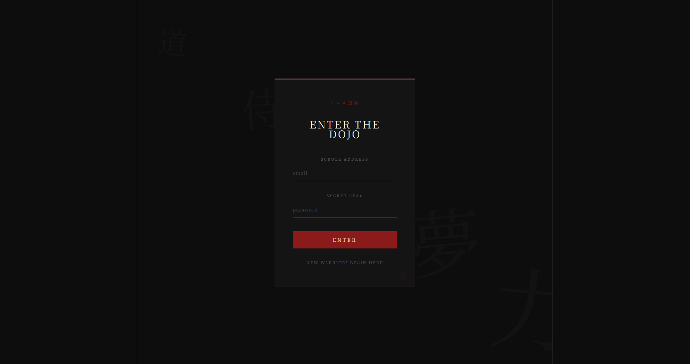
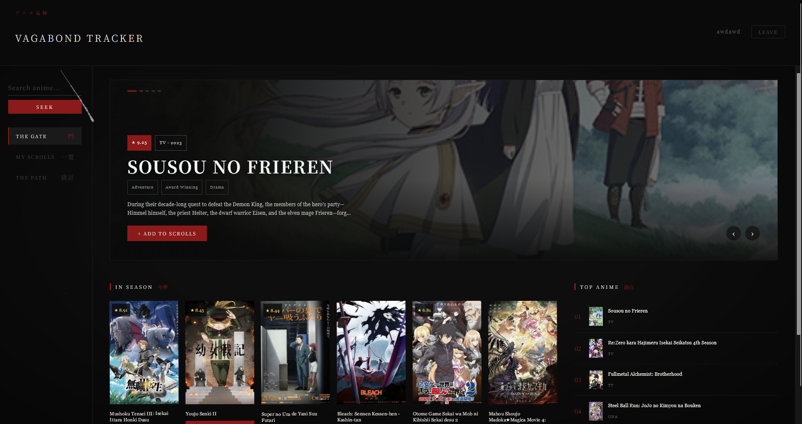

## 🖼️ Preview

### 🏯 Core Interface & Layouts

<table width="100%">
  <tr>
    <td width="50%" align="center"><b>The Gate Login (Secret Seal)</b></td>
    <td width="50%" align="center"><b>The Gate Homepage (Main Dashboard)</b></td>
  </tr>
  <tr>
    <td></td>
    <td></td>
  </tr>
  <tr>
    <td align="center"><b>Anime Details View (Bleach Example)</b></td>
    <td align="center"><b>My Scrolls (Interactive Tracker List)</b></td>
  </tr>
  <tr>
    <td></td>
    <td></td>
  </tr>
</table>

# ⚔️ VAGABOND TRACKER (アニメ追跡)

> A cinematic, avant-garde Anime Tracker inspired by the meditative and brutal ink-wash (*sumi-e*) aesthetic of Takehiko Inoue's legendary manga **"Vagabond"**. This is not just a standard catalog; it is an interactive web experience wrapped around the philosophy of a warrior's path.
>
> *Created with dedication to the warrior's path and flawless code architecture. 🏯*

---

## 👁️ Visual Philosophy & UX Innovations

* **THE GATE (Врата):** A replacement for standard homepages. Features an expansive, cinematic wide-screen anime carousel with seamless navigation, custom ratings, and integrated season charts.
* **MY SCROLLS (Мои свитки):** A completely redesigned anime list interface styled after traditional ancient scrolls. Static layouts are broken down into asymmetrical interactive grids.
* **THE PATH SO FAR (Путь):** An analytical dashboard built on raw SQL aggregates, rendering user stats through large reactive Japanese Kanji (**観, 完, 計, 棄**) that dynamically wobble and breathe on interaction.
* **Ink-Wash Handling (Error 504/429):** When free Jikan API gateways timeout, the app safely handles memory states, triggers a 3-step automatic retry mechanism, and yields a muted crimson interface with custom `RETRY` actions instead of freezing.
* **The Secret Seal Login:** Authentication routes disguised as ancient security layers. Usernames are mapped to **WARRIOR NAME**, emails to **SCROLL ADDRESS**, and encrypted passwords to **SECRET SEAL**.

---

## 🛠️ Tech Stack & Architecture

### Frontend (Client)


* **Axios Instance Layer:** Powered by structural request interceptors for automatic JWT session attachment.
* **Monochrome Paper-Grain Styling:** Custom utility grids with atmospheric vignette aesthetics.

### Backend & Cloud (Server)


* **Raw SQL Optimization:** Relational database infrastructure utilizing optimized `COALESCE` statements for partial resource patches (`PATCH`), custom cascade deletions, and unique structural key constraints.
* **Security & Auth:** Password hashing utilizing salted `bcryptjs` and session authorization via secured `jsonwebtoken` tokens with an automatic `/auth/me` validation endpoint.

---

## 📁 Repository Structure

```text
vagabond-anime-tracker/
├── client/              # React + Vite frontend application
│   └── src/
│       ├── api/         # Centralized Axios configs and Jikan API integration
│       ├── pages/       # AuthPage, TrackerPage (The Gate, Scrolls, Path)
│       └── main.jsx     # Virtual DOM entrypoint
└── server/              # Node.js + Express + PostgreSQL core
    ├── .env.example     # Environment template
    ├── db.js            # Automatic pool initialization and table creation schema
    └── server.js        # REST endpoints, custom JWT middlewares & core routing
```

---

## 🚀 Local Deployment (Entering The Dojo)

### 1. Clone the repository
```bash
git clone https://github.com/zxcmazokdyrak12/vagabond-anime-tracker.git
cd vagabond-anime-tracker
```

### 2. Setup the Database & Server
Navigate to the `/server` directory and install back-end packages:
```bash
cd server
npm install
```
Create a `.env` file based on `.env.example` and supply your `DATABASE_URL` (PostgreSQL connection string) and `JWT_SECRET`. 

Boot the backend:
```bash
npm start
```
*The database tables will initialize automatically on boot. Terminal will log: `DB ready -> Server: http://localhost:3002`.*

### 3. Launch the Frontend
Navigate to the `/client` directory and install dependencies:
```bash
cd ../client
npm install
```
Launch the Vite development server:
```bash
npm run dev
```
Open `http://localhost:5173` in your browser, click **BEGIN YOUR PATH**, and enter the dojo.

---

## ⚖️ License & Disclaimer

Vagabond Tracker is a non-commercial fan project created purely for educational and portfolio demonstration purposes. All structural visual assets, original concepts, and character artwork references belong to Takehiko Inoue and Kodansha.
